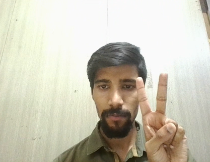
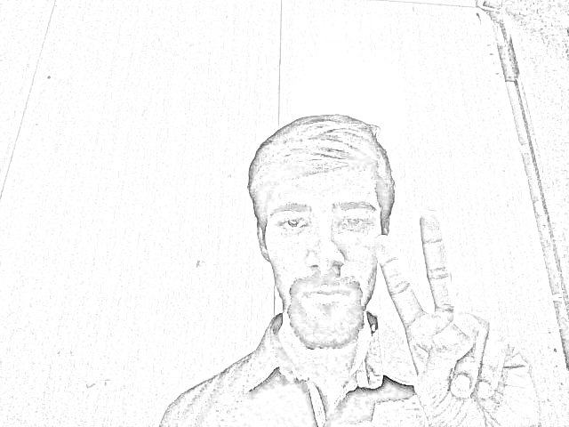

## 🖼️ Real-Time Sketch Filter App

This is a real-time computer vision web app that applies a **pencil sketch filter** to a live webcam feed using **OpenCV** and **Streamlit**. It displays the original video alongside the sketch version and allows you to save snapshot images of the sketch output.

---

### 📌 Features

* 📷 Real-time video feed from your webcam
* ✏️ Instant sketch transformation using OpenCV
* 🔀 Side-by-side view of the original and sketch output
* 💾 Option to save sketch snapshots with one click
* 🌄 Beautiful background image for enhanced UI experience

---

### 🛠️ Tech Stack

* **Python**
* **OpenCV** – for image processing
* **NumPy** – for array operations
* **Streamlit** – for building the web UI
* **Base64/CSS** – to set custom background image

---

### 📂 Folder Structure

```
.
├── app.py                # Streamlit app main file
├── sketch_utils.py       # Utility functions (sketch effect and snapshot saving)
├── Snapshot/             # Folder where snapshots are saved
└── README.md             # Project documentation
```

---

### ▶️ How to Run

1. **Install dependencies**

   ```bash
   pip install opencv-python streamlit numpy
   ```

2. **Run the app**

   ```bash
   streamlit run app.py
   ```

3. **Usage**

   * ✅ Check **"Start Camera"** to begin webcam streaming.
   * 📸 Click **"Save Snapshot"** to save the current sketch image to the `Snapshot` folder.

---

### 🖼️ Sample Output

| Original Feed              | Sketch Output              |
| -------------------------- | -------------------------- |
|  |  |

---

### 📁 Snapshot Saved Example

Snapshots will be saved in the `Snapshot/` folder with filenames like:

```
sketch_20250612_191500.png
```

---

### 💡 Behind the Scenes

The sketch effect is generated using the following steps:

1. Convert image to grayscale
2. Invert the grayscale image
3. Apply Gaussian blur to the inverted image
4. Blend the grayscale image with the blurred version using a `cv2.divide()` method

This produces a pencil-like sketch effect in real-time.

---

### 💡 Future Enhancements

1. Integrate hand gesture recognition to trigger snapshots ✌️
2. Add filters (e.g., cartoon, oil paint)
3. Develop a full GUI (Tkinter or Streamlit)
4. Allow uploading and sketching from static images

---

## 👨‍💻 Author

Developed as a part of my internship project named as **"Sketch Filter App"**.

```
